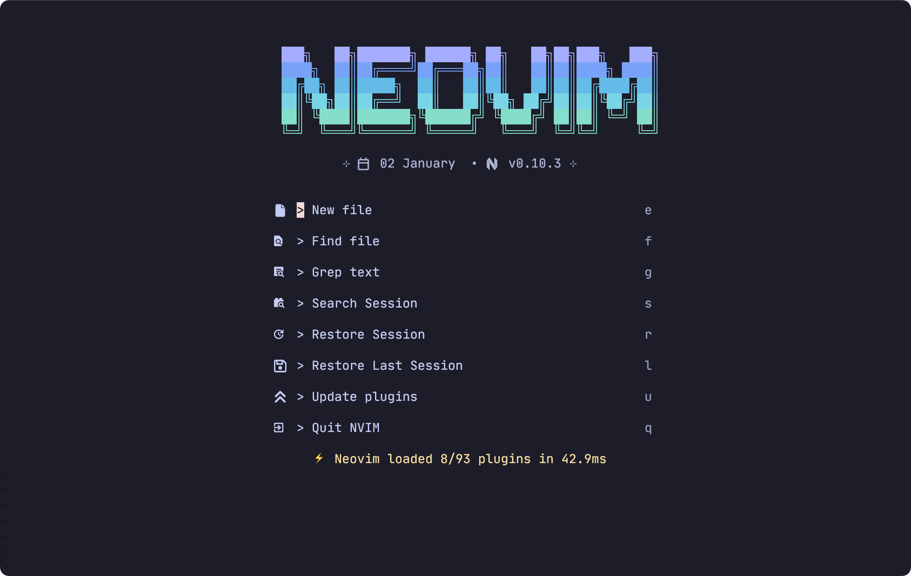
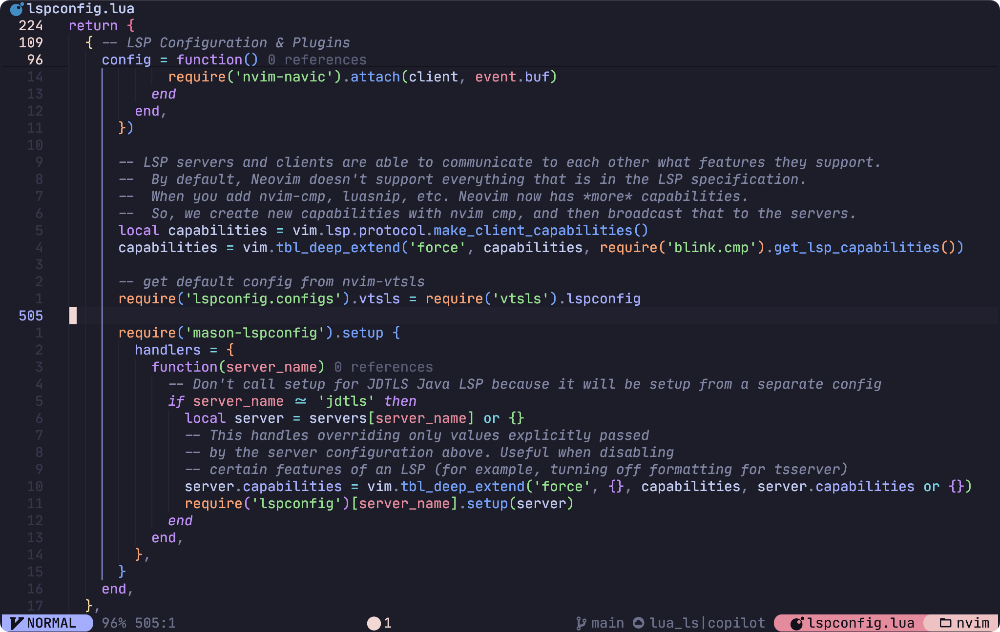
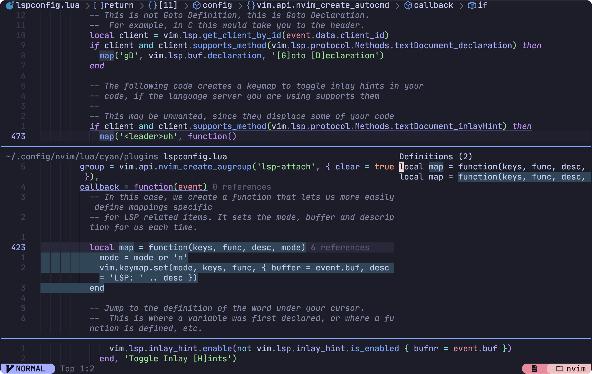
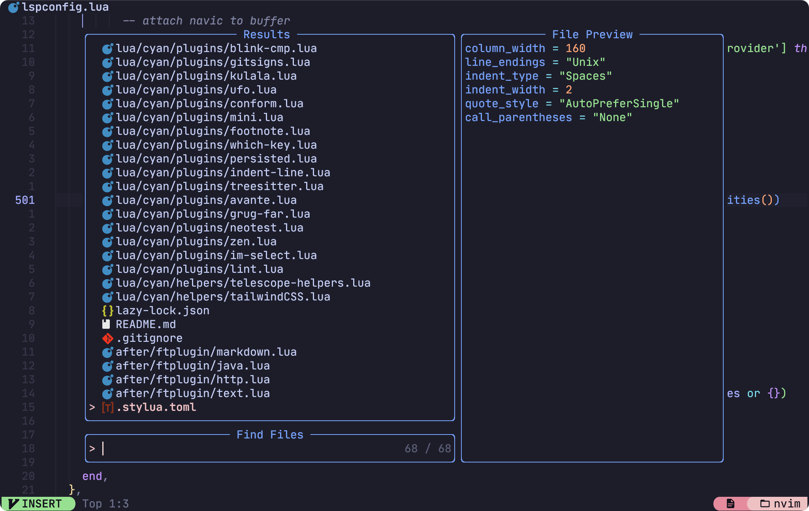

# Neovim config

> This repo is deprecated. Please refer to my new [dotfiles](https://github.com/chenxin-yan/nix-dotfiles#) managed using Nix Home Manager

<!--toc:start-->

- [Dependencies](#dependencies)
- [Installation](#installation)
- [Feature](#feature)
- [Language support](#language-support)
- [Keymaps](#keymaps)
- [Roadmap](#roadmap)
<!--toc:end-->

A minimal Catppuccin neovim config built from [kickstart.nvim](https://github.com/nvim-lua/kickstart.nvim)









## Dependencies

1. Basic utils: git, make, unzip, C Compiler (gcc)
2. ripgrep
3. Clipboard tool (xclip/xsel/win32yank or other depending on platform)
4. A terminal supports 256-color such as [iTerm2](https://iterm2.com/index.html)
5. A [Nerd Font](https://www.nerdfonts.com/#home)
6. [Neovim](https://neovim.io)
7. [Lazygit](https://github.com/jesseduffield/lazygit)
8. [Yazi](https://yazi-rs.github.io)
9. Language dependencies (see [Language Support](#language-support))

## Installation

Make sure to **backup your current config** before installation

```bash
git clone https://github.com/chenxin-yan/nvim.git "${XDG_CONFIG_HOME:-$HOME/.config}"/nvim
nvim
```

## Feature

- [Neovide](https://github.com/neovide/neovide) support
- Obsidian support
- tmux support

## Language support

| Language              | Lsp               | Formatter                      | Linter          | Debugger           | Testing                       |
| --------------------- | ----------------- | ------------------------------ | --------------- | ------------------ | ----------------------------- |
| Lua                   | ✅ luals          | ✅ stylua                      | ❌              | ❌                 | ❌                            |
| C/C++                 | ✅ clangd         | ✅ clangd                      | ✅ clangd       | ✅ codelldb        | ❌                            |
| Java                  | ✅ jdtls          | ✅ jdtls                       | ✅ jdtls        | ✅ jdtls           | ✅ java-test                  |
| JavaScript/TypeScript | ✅ vtsls          | ✅ Biome/prettierd             | ✅ Biome/Eslint | ✅ vscode-js-debug | ✅ neotest-jest/vimtest-mocha |
| Golang                | ✅ gopls          | ✅ gofumpt, goimports, golines | ❌              | ✅ delve           | ✅ neotest-golang             |
| Python                | ✅ Pyright        | ✅ Ruff                        | ✅ Ruff         | ✅ debugpy         | ✅ neotest-python             |
| Markdown              | ✅ marksman       | ✅ prettierd, markdownlint     | ✅ markdownlint | ❌                 | ❌                            |
| HTML                  | ✅ html-lsp       | ✅ prettierd                   | ❌              | ❌                 | ❌                            |
| CSS                   | ✅ css-lsp        | ✅ Biome/prettierd             | ❌              | ❌                 | ❌                            |
| Tailwind CSS          | ✅ tailwindcss-ls | ❌                             | ❌              | ❌                 | ❌                            |
| JSON                  | ✅ jsonls         | ✅ Biome/prettierd             | ❌              | ❌                 | ❌                            |
| TOML                  | ✅ taplo          | ✅ taplo                       | ❌              | ❌                 | ❌                            |
| YAML                  | ✅ yamlls         | ✅ yamlls                      | ❌              | ❌                 | ❌                            |
| Docker                | ✅ dockerls       | ✅ dockerls                    | ✅ hadolint     | ❌                 | ❌                            |

## Keymaps

This config uses [which-key.nvim](https://github.com/folke/which-key.nvim) to display available keymaps

## Roadmap

- [ ] add warning comments config files for hard-coded paths
